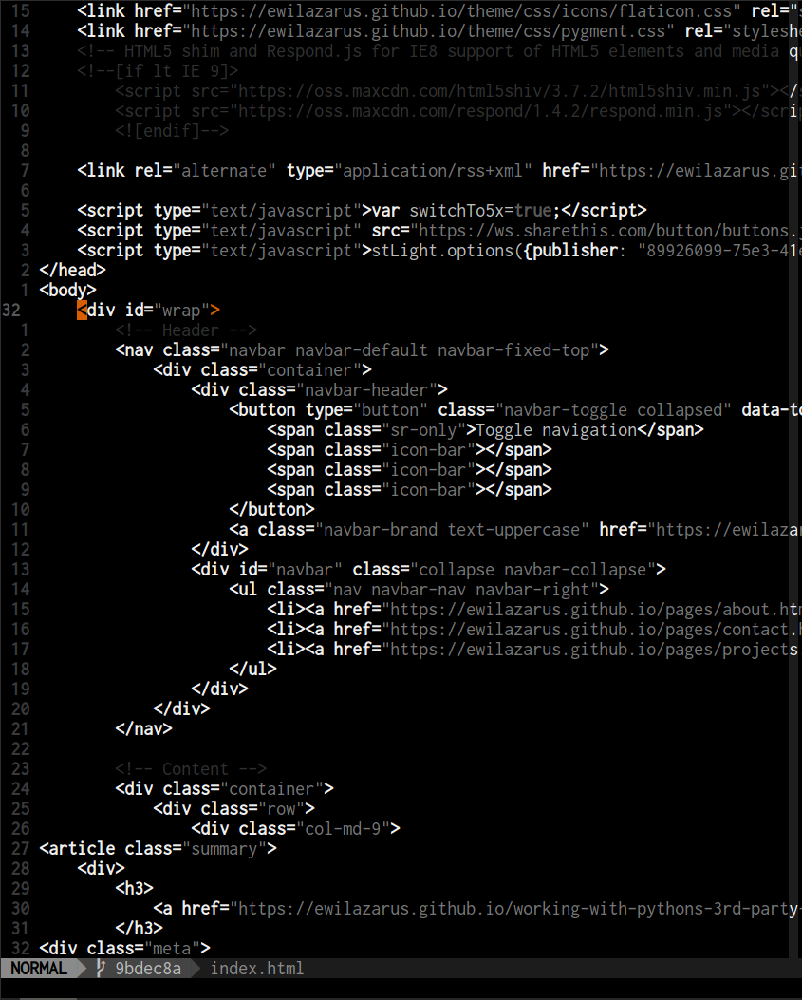
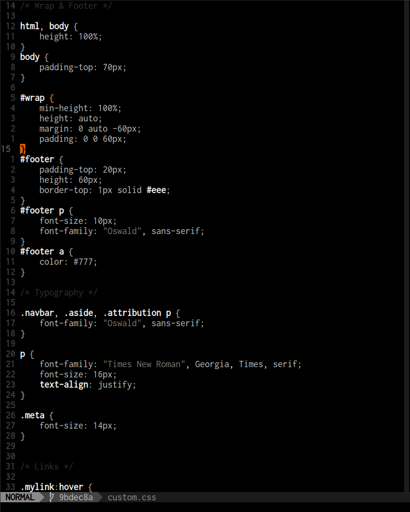

Preto
======

|
| A minimal dark color scheme for VIM, inspired by `badwolf`_ and `256_noir`_.

Examples
========

C:
--

.. image:: images/c_screenshot.png

Python:
------

.. image:: images/python_screenshot.png

Clojure:
-------

.. image:: images/clojure_screenshot.png

Clojure (with Rainbow Parentheses):
----------------------------------

.. image:: images/clojure_rp_screenshot.png

HTML:
----

CSS:
---

.. _`badwolf`: https://github.com/sjl/badwolf/
.. _`256_noir`: https://github.com/andreasvc/vim-256noir
